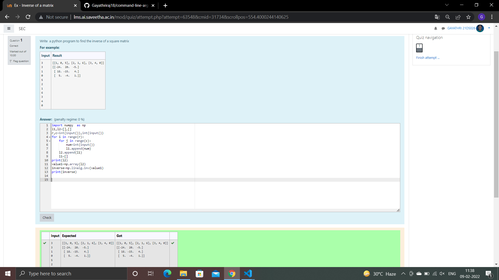

# Multiplying-two-matrix

## AIM:

## ALGORITHM:

# Step 1:
Use import numpy as np

# Step 2:
Enter the input

# Step 3:
Use append()

# Step 4:
use to multiply two matrix

# Step 5:
print

## PROGRAM: 
``` python
import numpy  as np
l1,l2=[],[]
r,c=int(input()),int(input())
for i in range(r):
    for j in range(c):
        num=int(input())
        l1.append(num)
    l2.append(l1)
    l1=[]
print(l2)
value1=np.array(l2)
inverse=np.linalg.inv(value1)
print(inverse)
```
## OUTPUT:

## RESULT:


